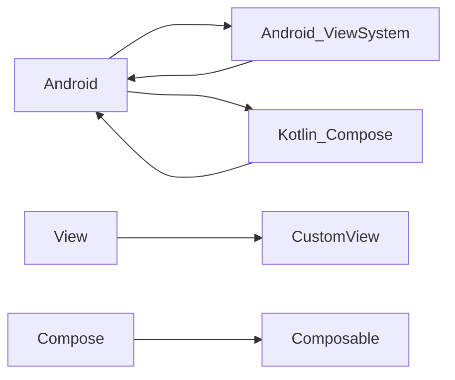

# UIX-DICT // 화면에 대한 이해

## Overview

안드로이드 UI/UX 를 포함하여 화면에 대한 이해를 하고자 연구하는 저장소 입니다.  Compose, ViewSystem 종속적이지 않고 화면자체를 위해서 작성하고자 합니다.  

## Index (추가될 예정입니다.)

- ViewSystem
    - CustomView
- Compose
    - Composable

